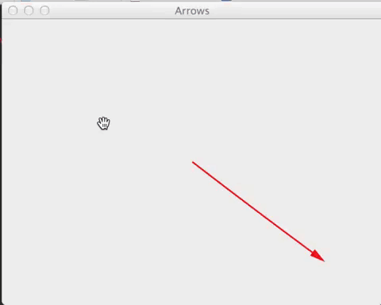

# Animated Arrows With Core Animation

I’m building a Mac OS X app needs to draw arrows. Rather than just draw some plain arrows I thought I’d have some fun with it.

My first design was to make the arrow “shoot” out and then thwang once it hits the target. Thwanging would involve making the arrow line oscillate, like a guitar string.

At first I though that I was going to have draw each frame in a drawRect or drawLayer. This would be a giant pain as you would have to manage a timer and ticks for the animation, sync with the screen refresh etc. Luckily I remembered about the amazing CAShapeLayer. CAShapeLayer allows you to set a path and drawing options and then animate to a new path and drawing options. This is so much easier and it’s going to be dramatically more efficient. So let's get started.

First thing is to make a CGPathRef with our desired arrow shape. I modified the arrow from this [SO answer](http://stackoverflow.com/questions/13528898/how-can-i-draw-an-arrow-using-core-graphics).

This will live in our view class RLArrowView

This will produce a path that is arrow shaped and has a bend about halfway up. You set the amount of the bend with the wiggle param.

Now on mouse down create the arrow at the click point.

Now we should have an arrow starting from the middle, pointing to the mouse and 20 pts long.

Now the Core Animation fun begins. To make the arrow animate to the mouse point, create a new path to the mouse location and set it in an animation.

Great but what about the thwang? To make the arrow oscillate, call a new function from the completion handler to redraw the path with a bend in it. Negate and dampen the wiggle parameter and call the function again, quit when it's too small to matter

the full view class on [github](https://gist.github.com/briandw/5851592)
